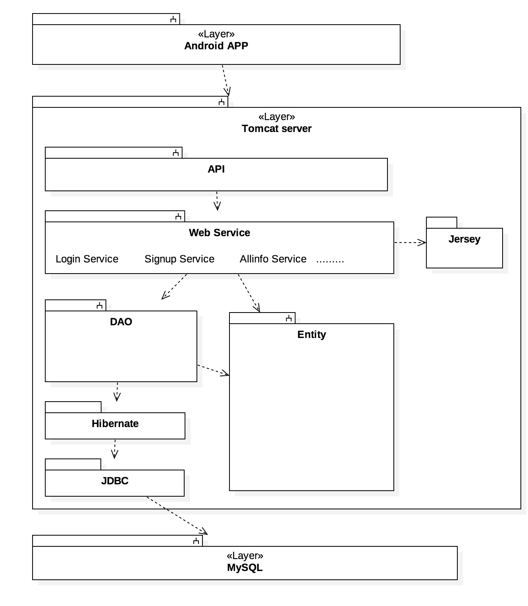
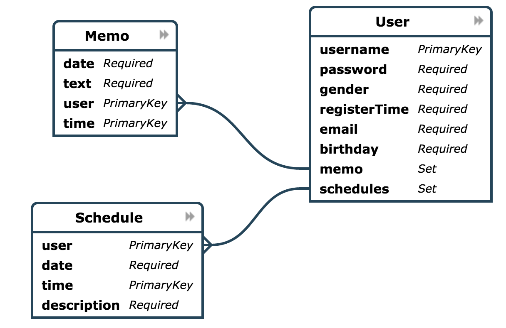

# SOA_final project
#Description
Our App is a multi-purpose calendar. We create it to help our users to remember their important things. Users can use it to record everything they may forget soon. The two main functions is “Schedule” and “Memo”, which is designed for users to select images from their album and write something. The calendar can “read” information from your photos, and then save it in your schedule.

#Requirement analysis

###Sign Up: 
Users can register a new account to save their schedules. They are requested to choose a username and a password, and offer their gender, e-mail address and birthday. Then they can get an account to use our calendar.

###Log In: 
Users can log in on the main page. Then they can see their schedules on the calendar.

###Info: 
Users can click “Home” in the left page to see their informations, including everything they offered when they register the account.

###Schedule: 
Users can select an image from their album. After that, our calendar will identify the words in that photo, and then return the details in it.

###Memo: 
Users can input everything they want to record in this page. They just need to input dates and contents.

###Calendar: 
When users enter our app, they can see all days sequenced by week and month. Besides, users’ schedules are shown on that day’s list.
#Configuration and Deployment Description
###Development environment:
####Frontend
* Andriod Studio 2.2.x
* Moto SDK22
####Backend
* IntelliJ IDEA 2016.2.5
###Configurations:
1.Bulid APK 
2.Run the prject 
#System Architecture
##Package Diagram

The architecture of Vision Calender is clear and not sophisticated.
We use **JDBC** to connect to our **MySQL** server, and use **Hibernate ORM** to map our database schema to classes in **Entity**.
We encapsulated all **CRUD** and other operation which conserns Hibernate or database in our **DAO** package, so other layers can consider about the logic only.
In webAPP we have all our web services. For the web service, we choose to use **Restful API**. Also, we use **Maven** to combine **Hibernate** and **Jersey**.

##Database Design

#API Document
###Login `/login?`
<pre><code>120.77.39.186:8080/SOA/soa/login?
form-data:
    username: username
    password: password</code></pre>

###Signup `/signup?`
<pre><code>120.77.39.186:8080/SOA/soa/signup?
form-data:
    username: username
    password: password
    gender:0/1
    birthday:birthday
    email:email</code></pre>

###Userinfo `/userinfo?`
<pre><code>120.77.39.186:8080/SOA/soa/userinfo?
form-data:
    username: username</code></pre>

###Memoinfo `/memoinfo?`
<pre><code>120.77.39.186:8080/SOA/soa/memoinfo?
form-data:
    user: username
    date:date</code></pre>

###Scheduleinfo `/scheduleinfo?`ø
<pre><code>120.77.39.186:8080/SOA/soa/scheduleinfo?
form-data:
    user: username
    date:date</code></pre>

###Allinfo `/allinfo?`
<pre><code>120.77.39.186:8080/SOA/soa/allinfo?
form-data:
    user: username
    date:date
    choice:0/1/2</code></pre>
This API hopes to fetch both memo and schedule info according to username and date. We try to realize the Service Compositon, but we don't confirm what we did was right.

* choice:0 return memo,schedule
* choice:1 return memo
* choice:2 return schedule

###Addmemo `/addmemo?`
<pre><code>120.77.39.186:8080/SOA/soa/addmemo?
form-data:
    user: username
    date:date
    text:text</code></pre>

###Addschedule `/addschedule?`
<pre><code>120.77.39.186:8080/SOA/soa/adschedule?
form-data:
    user: username
    date:date
    description:description</code></pre>

#Team collaboration
###Division of work
- **1350588 胡贝妮 **  
    - System architecture design  
    - Back-end development  
    - Part of fore-end design
- **1452661 冯雨晴 ** 
    - Back-end development  
    - Part of fore-end design
    - Parse API
- **1452798 李想 ** 
    - Front-end development 
    - Write Document
